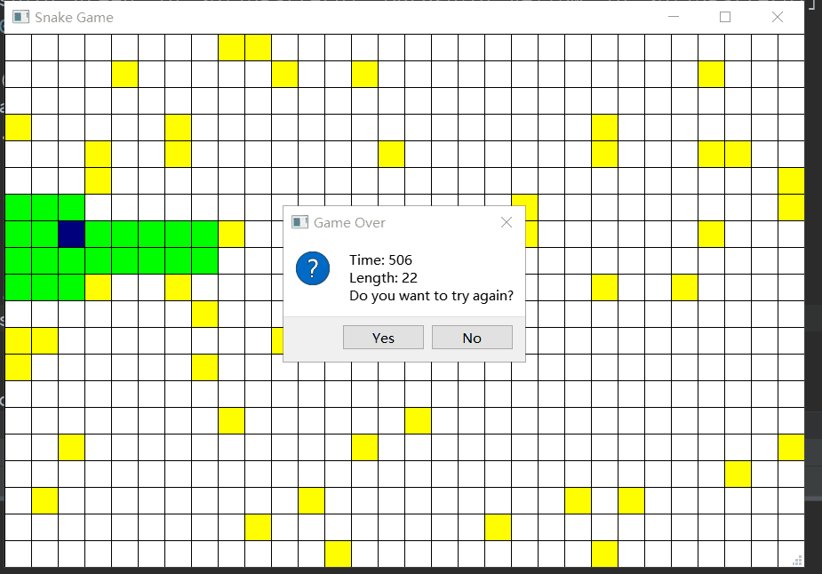
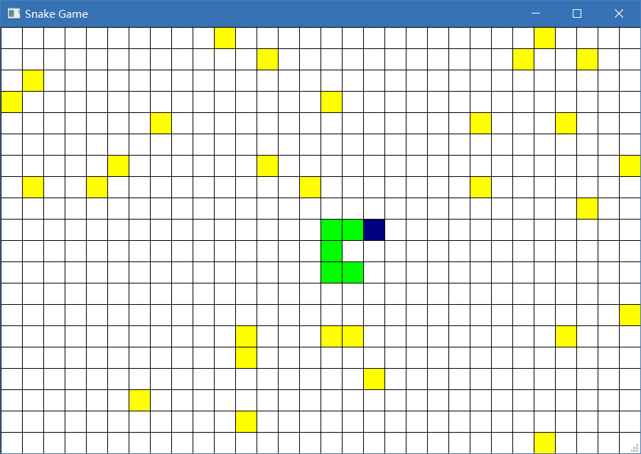
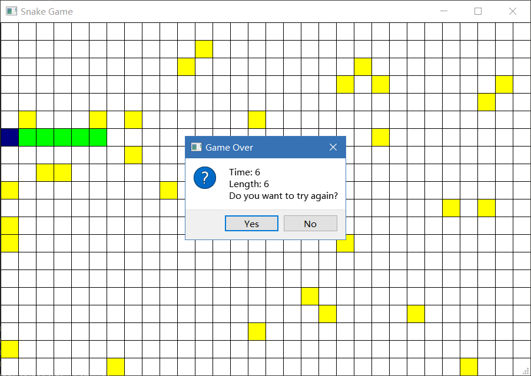

# Snake Game

## Description
This is a simple snake game coded with python3 and PyQt5.
### What's new?
1. **Snake can feed automatically, you can turn this off in the settings file.**
2. You can set this game by edit "congif.json"

### Snake automatic foraging


### Snapshot 1


### Snapshot 2


## How to play it?
Use key W, A, S, D to control the snake to move and eat. Be careful of the wall and the snake's body.

Good luck!

## I want to set up it, how?
Open the file "config.json" with any code editor, and change the following variables. 
```json
{
    "AUTO_PLAY":true,
    "BOARD_COLUMN":30,
    "BOARD_ROW":20,
    "FOOD_NUM":30,
    "SPEED":500,
    "TIME_INTERVAL":5
}
```

## About author
```python
AUTHOR = None
CLASS = None
ID = None
EMAIL = None
```